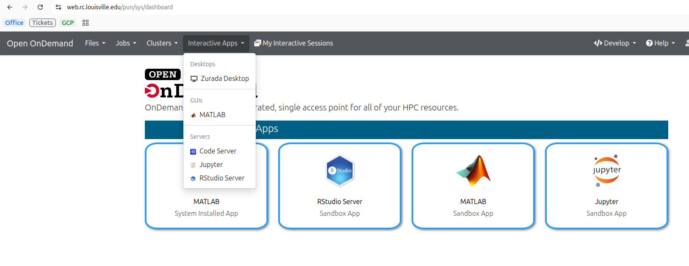
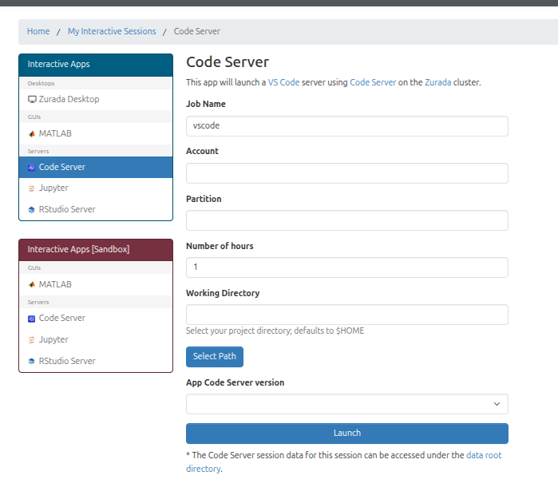
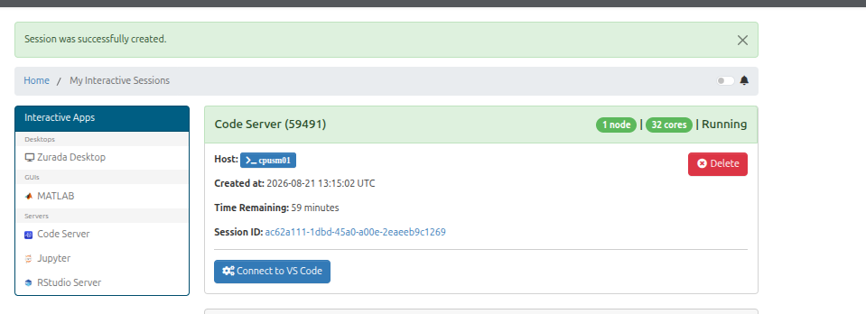

Code Server / VS Code (Open On Demand)
======================================

Launching Code Server via OpenOnDemand
-------------------------------------

This guide explains how to launch Code Server (VS Code in the browser) through the Open OnDemand portal.

.. contents:: Table of Contents
	:depth: 2
	:local:

Prerequisites
-------------

* An active HPC Zurada cluster account.
* Access to the campus network or VPN.
* A supported web browser (Chrome, Firefox, or Edge).

Step 1: Access Open OnDemand
----------------------------

1. Open your browser and navigate to the Open OnDemand portal at `https://web.rc.louisville.edu <https://web.rc.louisville.edu>`_

	Figure 1: Selecting Code Server from the Interactive Apps menu.

.. raw:: html

	

Step 2: Start a Code Server Session
-----------------------------------

1. Choose **Code Server** (or **VS Code**) from the Interactive Apps list.
2. Configure CPU/memory and walltime then click **Launch**.

	Figure 2: Example Code Server session card in Interactive Sessions.

.. raw:: html

	

Step 3: Connect to the IDE
--------------------------

1. When the session status shows **Running**, click the blue **Connect** button on the session card to open the Code Server IDE in a new tab.

	Figure 3: Click the Connect button to open the Code Server IDE in a new tab.

.. raw:: html

	

