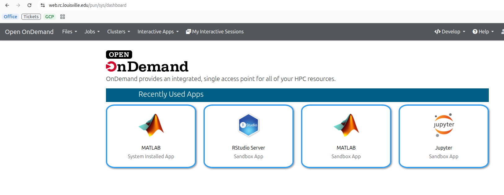

Open OnDemand
#############

Open OnDemand provides a web-based graphical interface for the Zurada HPC system. It allows you to manage files, open terminal sessions, submit Slurm jobs, and run interactive applications like Jupyter and RStudio directly in your browser—no command-line setup required.

1. Prerequisites & Access Requirements
======================================

Prerequisites
-------------

* An active HPC Zurada account.
* A connection to the UofL network or the *UofL Global Protect VPN (if off-campus).

Step 1: Access Open OnDemand
----------------------------

1. Open your browser and navigate to the Open OnDemand portal at `https://web.rc.louisville.edu <https://web.rc.louisville.edu>`_

   Figure 1: Open OnDemand authentication screen.

.. raw:: html

   

 
2. Dashboard Navigation Overview
================================
 
Once logged in, the top navigation bar grants access to all cluster management modules:
 
.. list-table::
   :header-rows: 1
   :widths: 25 75

   * - Navigation Menu
     - Primary Functions
   * - **Files**
     - Browse, view, edit, upload, download, and manage files in ``/home`` and ``/work``.
   * - **Jobs**
     - Access **Job Composer** (create scripts) and **Active Jobs** (monitor Slurm queue status).
   * - **Clusters**
     - Launch a web-based SSH terminal session (``>_ Zurada Shell Access``).
   * - **Interactive Apps**
     - Launch GUI environments (**VS Code**, **Jupyter**, **RStudio**, **MATLAB**).
   * - **My Interactive Sessions**
     - View runtime status, manage connections, or terminate active app sessions.
 
3. Interactive Applications Guide
=================================
 
Interactive apps run on dedicated compute nodes allocated to your account by Slurm.

.. toctree:: 
   :maxdepth: 1

   rstudio
   jupyter
   codeserver
   matlab
   zurada_desktop
 
.. tip::
   Submit reasonable walltimes and core counts. Smaller resource requests schedule significantly faster in the Slurm queue than large requests.
 
4. Using Custom Conda Environments
==================================
 
To use custom Python environments inside **VS Code** or **Jupyter**:
 
1. Open **Clusters** > **>_ Zurada Shell Access** and create your environment:
 
.. code-block:: bash
 
   module load miniforge3
   conda create --prefix /work/$USER/my_env python=3.10 ipykernel -y
   conda activate my_env
   python -m ipykernel install --user --name my_env --display-name "Python (my_env)"
 
2. When launching **Jupyter** or **VS Code** in Open OnDemand, your new environment kernel `"Python (my_env)"` will appear automatically in the environment selector dropdown.

5. Slurm Job Management
=======================
 
Job Composer (Batch Scripts)
----------------------------
 
If you do not need a GUI desktop and want to run non-interactive batch scripts:
 
1. Navigate to **Jobs** > **Job Composer**.
2. Click **New Job** > **From Specified Template** or **From Default Template**.
3. Edit your Slurm batch script directly in the built-in editor:
 
.. code-block:: bash
 
   #!/bin/bash
   #SBATCH --job-name=demo_job
   #SBATCH --output=demo_%j.out
   #SBATCH --nodes=1
   #SBATCH --ntasks=1
   #SBATCH --cpus-per-task=4
   #SBATCH --time=01:00:00
   #SBATCH --mem=8G
 
   module load matlab
   matlab -nodisplay -nosplash -r "my_script; exit;"
 
4. Click **Submit** to dispatch the script to the Slurm queue.
 
Active Jobs (Queue Monitor)
---------------------------
 
1. Go to **Jobs** > **Active Jobs**.
2. View all queued, running, or held jobs across the cluster.
3. Filter by User (``$USER``) to monitor your personal jobs or inspect job IDs, start times, and allocated nodes.
 
6. File Management & Terminal Access
====================================
 
Browser File Explorer
---------------------
 
* Navigate to **Files** > **Home Directory** or **Work Directory**.
* Drag and drop files from your computer to upload.
* Select text scripts or configuration files and click **Edit** to open the built-in web code editor.
 
In-Browser SSH Terminal
-----------------------
 
1. Navigate to **Clusters** > **>_ Zurada Shell Access**.
2. An SSH shell session opens directly on the Zurada login node. You will need to perform a DUO push verification
 
.. code-block:: bash
 
   # Monitor your submitted jobs
   squeue -u $USER
 
   # Check scratch storage usage
   df -h /work/$USER
 
7. Troubleshooting & FAQs
=========================

**Q. When I click Connect I see Failed to connect to something like cpusm75:33382**
  * *Cause:* Your node is not quite setup for the interactive application
  * *Fix:* Do not restart the session, wait for about 30s to a minute and try pressing connect again.
 
**Q: My session stays in the "Queued" state for a long time.**
  * *Cause:* Requested CPU or walltime limits exceed current free node capacity.
  * *Fix:* Go to **My Interactive Sessions**, click **Delete**, and resubmit with fewer cores, less RAM, or shorter walltime.
 
**Q: App crashed or disconnected automatically.**
  * *Cause:* Job exceeded the requested **Walltime** limit.
  * *Fix:* Re-launch the session with longer runtime.
 
**Q: "Bad Gateway" or "404 Not Found" error upon launch.**
  * *Cause:* The compute node instance died unexpectedly or did not start the web service in time.
  * *Fix:* Delete the failed session under **My Interactive Sessions**, refresh your browser, and launch a fresh session.

.. note::
   
   - These guides assume you have a valid account and have requested access to Zurada.
   - Replace any example hostnames or project names with values provided by Research Computing.
 