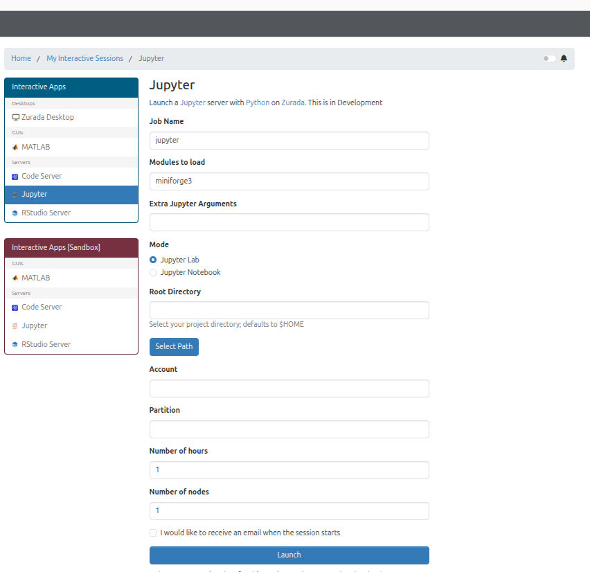

Jupyter (Open OnDemand)
=========================

Overview
--------

This guide provides step-by-step instructions for launching interactive **Jupyter Notebook / JupyterLab** sessions on the High-Performance Computing (HPC) cluster using the Open OnDemand web portal.

Step 1: Navigate to Jupyter Application
----------------------------------------

1. On the top navigation bar, click on **Interactive Apps**.
2. Select **Jupyter Notebook** (or **JupyterLab**) from the drop-down menu.

.. figure:: images/interactive_apps_menu.png
   :width: 50%
   :alt: Interactive Apps Dropdown Menu
   :align: left

   Figure 1: Selecting Jupyter Notebook from the Interactive Apps menu.

.. raw:: html

   

Step 2: Configure Job Options
-----------------------------

Fill in the form parameters according to your resource requirements:

.. list-table:: Form Parameters
   :widths: 25 75
   :header-rows: 1

   * - Parameter
     - Description
   * - **Job Name**
     - A custom identifier for your session (e.g., ``jupyter_analysis``).
   * - **Project / Account**
     - Your Ulink id.
   * - **Partition**
     - Choose the compute partition.
   * - **Number of Hours**
     - Total runtime requested for the interactive session.
   * - **Number of Cores**
     - Number of CPU cores requested for computation.
   * - **Working Directory**
     - Starting directory for your Jupyter workspace. Defaults to ``/work/$USER``.

   Figure 2: Interactive session submission form.

.. raw:: html

   

Click the **Launch** button at the bottom of the page.

Step 3: Connect to the Running Session
--------------------------------------

1. After clicking **Launch**, you will be redirected to the **Interactive Sessions** card view.
2. The session card will initially display **Queued** or **Starting**.
3. Once resources are allocated, the status will change to **Running**.
4. Click the blue **Connect to Jupyter** button to open the notebook environment in a new tab.

.. figure:: images/connect_button.png
   :width: 50%
   :alt: Active Session Card with Connect Button
   :align: left

   Figure 3: Active session card displaying the "Connect to Jupyter" button.

.. raw:: html

   

Step 4: Terminate the Session
-----------------------------

When you have finished your work, close your interactive session to release compute resources for other users:

1. Return to the Open OnDemand **Interactive Sessions** page.
2. Click the red **Delete** button on the session card.

.. figure:: images/connect_button.png
   :width: 50%
   :alt: Delete Session Confirmation
   :align: left

   Figure 4: Deleting an active interactive session.

.. raw:: html

   

Troubleshooting
---------------

* **Session Fails to Submit:** Verify that your account has authorization for the selected partition (especially high-memory options like ``cpu1500g``).
* **Connection Timeout:** Ensure your browser is not blocking pop-up windows from the portal URL.