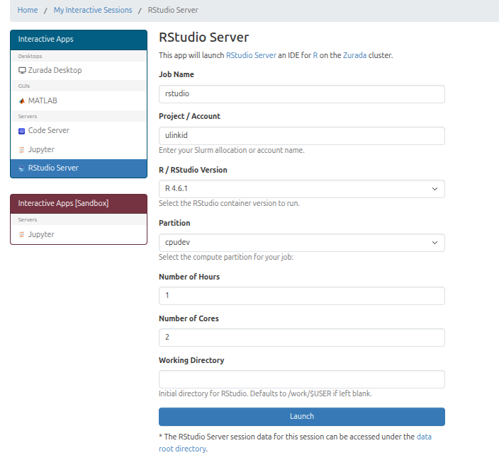
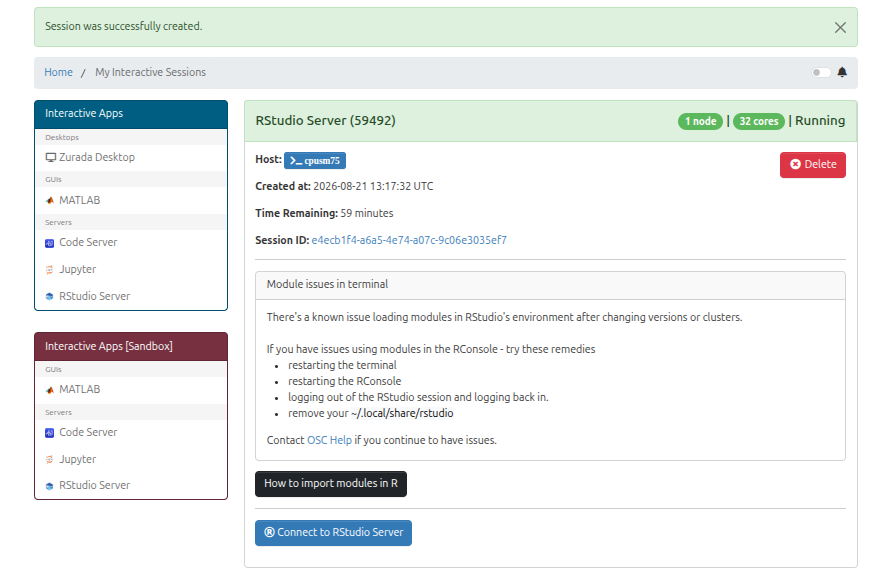
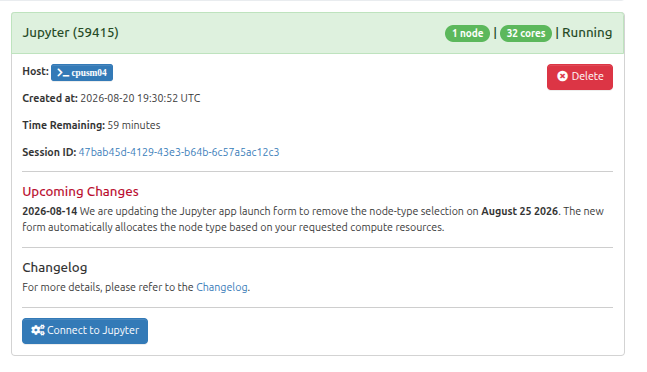

RStudio (Open OnDemand)
=========================

Overview
--------

This guide explains how to launch and use RStudio via the Open OnDemand (OOD) web portal on Zurada.

Step 1: Navigate to RStudio
---------------------------

1. On the top navigation bar, click on **Interactive Apps**.
2. Select **RStudio** from the drop-down menu.

.. figure:: images/interactive_apps_menu.png
	:width: 50%
	:alt: Interactive Apps Dropdown Menu
	:align: left

	Figure 1: Selecting RStudio from the Interactive Apps menu.

.. raw:: html

	

Step 2: Configure Job Options
-----------------------------

Fill in the form parameters according to your resource requirements:

.. list-table:: Form Parameters
	:widths: 25 75
	:header-rows: 1

	* - Parameter
	  - Description
	* - **Job Name**
	  - A job name for your session.
	* - **Account**
	  - Your ulink id.
	* - **Partition**
	  - Choose the compute partition.
	* - **Number of Hours**
	  - Total runtime requested for the interactive session.
	* - **Number of Cores**
	  - Number of CPU cores requested for computation.
	* - **Working Directory**
	  - Starting directory for your RStudio workspace. Defaults to ``/work/$USER``.

	Figure 2: Interactive session submission form.

.. raw:: html

	

Step 3: Connect to the Running Session
--------------------------------------

1. After clicking **Launch**, you will be redirected to the **Interactive Sessions** card view.
2. The session card will initially display **Queued** or **Starting**.
3. Once resources are allocated, the status will change to **Running**.
4. Click the blue **Connect** button to open the RStudio environment in a new tab.

	Figure 3: Example RStudio session card in Interactive Sessions.

.. raw:: html

	

Step 4: Terminate the Session
-----------------------------

When you have finished your work, close your interactive session to release compute resources for other users:

1. Return to the Open OnDemand **Interactive Sessions** page.
2. Click the red **Delete** button on the session card.

	Figure 4: Deleting an active interactive session.

.. raw:: html

	

