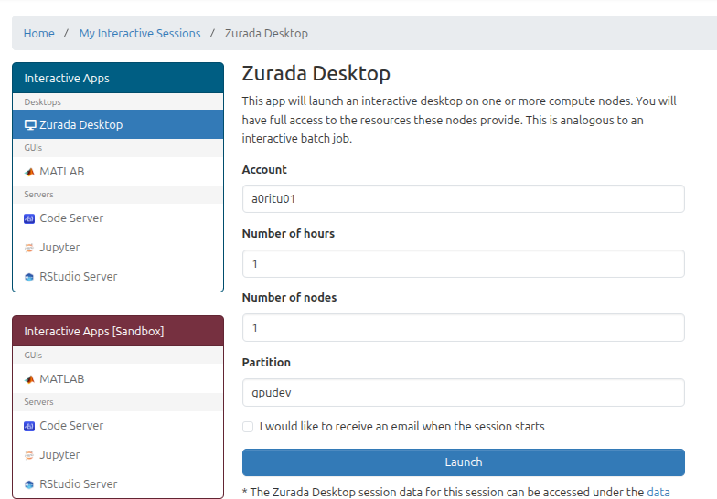
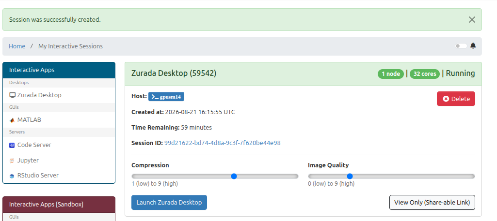

Zurada Desktop (Open OnDemand)
================================

Overview
--------

Use Zurada Desktop through the OOD Interactive Apps interface when desktop sessions are available. Interactive desktop sessions are useful for graphical applications and desktop-style workflows.

Prerequisites
-------------

* An active HPC Zurada account.
* A connection to the UofL network or the *UofL Cisco AnyConnect VPN (if off-campus).

Step 1: Access Open OnDemand
----------------------------

1. Open your browser and navigate to the Open OnDemand portal at `https://web.rc.louisville.edu <https://web.rc.louisville.edu>`_

.. figure:: images/OOD_mainpage.png
    :width: 50%
    :alt: Open OnDemand Login Screen
    :align: left

    Figure 1: OpenOnDemand authentication screen.

.. raw:: html

    

Step 2: Navigate to Zurada Desktop
----------------------------------

1. On the top navigation bar, click on **Interactive Apps**.
2. Select **Zurada Desktop** from the drop-down menu (if available).

.. figure:: images/interactive_apps_menu.png
    :width: 50%
    :alt: Interactive Apps Dropdown Menu
    :align: left

    Figure 2: Selecting Zurada Desktop from the Interactive Apps menu.

.. raw:: html

    

Step 3: Configure Job Options
-----------------------------

Fill in the form parameters according to your resource requirements:

.. list-table:: Form Parameters
    :widths: 25 75
    :header-rows: 1

    * - Parameter
      - Description
    * - **Account**
      - Your ulink id.
    * - **Number of Hours**
      - Total runtime requested for the interactive session.
    * - **Number of Nodes**
      - Number of nodes requested.

    Figure 3: Interactive session submission form.

.. raw:: html

    

Step 4: Connect to the Running Session
--------------------------------------

1. After clicking **Launch**, you will be redirected to the **Interactive Sessions** card view.
2. The session card will initially display **Queued** or **Starting**.
3. Once resources are allocated, the status will change to **Running**.
4. Click the blue **Connect** button to open the Zurada Desktop environment in a new tab.

    Figure 4: Example Zurada Desktop session card in Interactive Sessions.

.. raw:: html

    

Step 5: Terminate the Session
-----------------------------

When you have finished your work, close your interactive session to release compute resources for other users:

1. Return to the Open OnDemand **Interactive Sessions** page.
2. Click the red **Delete** button on the session card.

    Figure 5: Deleting an active interactive session.

.. raw:: html

    

