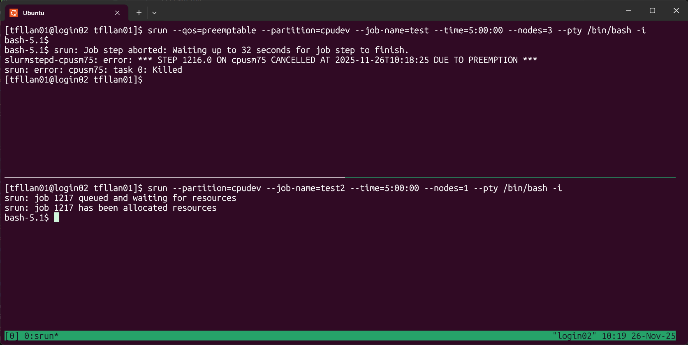

Preemptable Jobs
================

When you submit an interactive or batch job, queue limits are in place to prevent any single user from monopolizing all available nodes. While this ensures fairness, it can also lead to situations where jobs remain queued even though some resources are idle.

To address this, you can use preemption, which allows you to bypass the node limit in a queue. The tradeoff is that if a non-preemptable job (i.e. a regular job) later requests resources, your preemptable job will be terminated.

To make a job preemptable:

- For interactive jobs, add the parameter: ``--qos=preemptable`` to your ``salloc`` or ``srun`` command.
- For batch jobs, include: ``#SBATCH --qos=preemptable`` in your job script.

For example, the image below illustrates a preemptable interactive job (top pane) submitted to the ``cpudev`` queue. Although this queue normally limits users to a single node, the job successfully received an allocation of three nodes because the ``--qos=preemptable`` parameter was specified.

Later, a non-preemptable job (bottom pane) requested one node. Since resources could be reclaimed by terminating the preemptable job, Slurm ended the preemptable job to fulfill the allocation for the regular job.

If you submit a preemptable job, please make sure you are able to store partial
results and resume from a previous checkpoint.