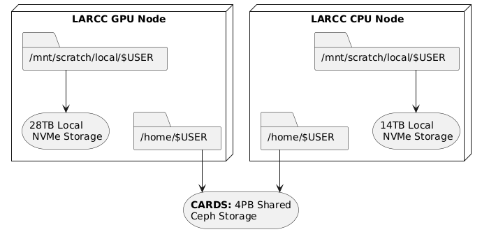

Storage Guide
#############

.. _storage-on-compute-nodes:

Understanding Storage on Compute Nodes
======================================

Storage types based on node accessibility
-----------------------------------------

When working on any compute node within the system, there are
two types of storage accessible to a node: local storage and shared storage. The former is only accessible by
a particular node, while the latter is accessible by all nodes.

On every node, the path ``/mnt/local/scratch/$USER`` points to local storage. That means if you have two nodes *N1* and *N2*,
anything stored at ``/mnt/local/scratch/$USER`` in *N1* won't be accessible by *N2* and vice-versa. In contrast, the
paths ``/work/$USER`` and ``/home/$USER`` point to a location in shared storage and are thus accessible by both *N1* and *N2*.

The described storage architecture is depicted in the diagram below:

Filesystem locations users should understand
--------------------------------------------

Scratch
^^^^^^^
- **Location on compute nodes:** ``/mnt/local/scratch/$USER``.
- **Shortcut Variable**: ``$SCRATCH``
- **Local to each compute node**: This storage is temporary, and local to a compute node. It is available to a user only 
  when a node is assigned for running jobs
- **High performance**: Offers significantly faster read/write speeds compared to home and work storage.
- **Limited capacity**: the capacity varies as per the node type and can be anywhere between 480 GB to 30 TB. Please refer
  to the table on the `Zurada hardware specs <https://ularc.github.io/zurada/gettingstarted/index.html#about-the-cluster>`_ for details
- **Data retention policy:** ALL DATA IS REMOVED after a job finishes.

Work
^^^^^
- **Location in filesystem:** ``/work/$USER``.
- **Shortcut Variable**: ``$WORK``
- **Shared across all nodes**: Accessible from any compute node in the system.
- **Large capacity**: Designed to store big files, datasets and, in general, input/output files used/produced by a job.
- **Slower access**: Due to its shared nature, read/write operations are generally slower than scratch storage.
- **Parallel I/O**: Multiple parts of large files can be accessed simultaneously (e.g. MPI-IO).
- **Data retention policy:** Files not accessed within 30 days are candidate for deletion.

Home
^^^^^
- **Location in filesystem:** ``/home/$USER``.
- **Shortcut Variable**: ``$HOME`` or ``~``
- **Shared across all nodes**: Accessible from any compute node in the system.
- **Limited capacity**: Hard quota limit of 25GB per user. If you try to write more than 25G, an error will be displayed
  and any subsequent write operations will be denied.
- **Slower access**: Due to its shared nature, read/write operations are generally slower than local scratch storage.
- **Data retention policy:** Data is kept and backed up for 7 days.

.. note::

   Shortcut variables in bash are set upon entry to a Zurada node, so you may utilize them while inside the system (scripts, navigation, etc). If you are using a command (ex. ``scp``, or ``rsync``) from your laptop/desktop/etc. utilization of the shortcut variables will not work.

Recommended Workflow
====================

A common and efficient workflow for running jobs on the system is:

1. **Prepare Input Data**: Copy necessary input files from your home or work storage to the node's local scratch storage at the start of your job.
2. **Run the Application**: Configure your application to read from and write to the local scratch storage during execution.
   This takes advantage of its high-speed performance.
3. **Save Results**: Once the job completes, copy the output files back to your work directory for longer term retention, or to home directory if you want them backed up.

See Section :ref:`Copying data between home and scratch <storage_copy_data>` for more information on how to implement
this worflow.

.. note::

   Always ensure that your input and output data will fit within the available space on ``scratch`` storage.
   If your files exceed this capacity, you may need to adjust your workflow accordingly.

.. _storage_copy_data:

Copying Data Between Home and Scratch
-------------------------------------

To efficiently transfer data between your shared ``home`` storage and node-local ``scratch`` storage, you can use ``pdsh``—a parallel remote shell client that executes commands across multiple nodes simultaneously.

The general template for the ``pdsh`` command includes three key components:

- ``-R ssh``: Specifies SSH as the remote shell method (always use ``ssh``).
- ``-w $SLURM_JOB_NODELIST``: Targets all nodes allocated to your job.
- **Remote command**: Executes on each node, leveraging the fact that ``home`` is shared while ``scratch`` is local.

.. note::

   Please note that while we talk about copying from ``home`` in this section, you may utilize your ``work``
   directory to copy to node-local ``scratch`` as well. Using your ``work`` directory might even be prefered given
   the size limitations of ``home``.

Below are common usage patterns:

Copy input data from home to scratch on all nodes
^^^^^^^^^^^^^^^^^^^^^^^^^^^^^^^^^^^^^^^^^^^^^^^^^

.. code-block:: bash

   pdsh -R ssh -w $SLURM_JOB_NODELIST "cp -r /home/$USER/input /mnt/local/scratch/$USER/"

For example, assume you submitted a batch job requesting 3 nodes and slurm allocated ``cpusm[01-03]`` such
that ``cpusm01`` is chosen as the node where the batch script is to be executed from. Then, the ``pdsh``
command above would:

#. Create 3 (parallel) ssh sessions from ``cpusm01`` to itself, ``cpusm02`` and ``cpusm03``.
#. Within each session, instruct the node to copy the folder ``/home/$USER/input`` to ``/mnt/local/scratch/$USER/``

.. image:: images/pdsh_home_to_scratch.png
   :width: 900
   :alt: Logical Storage Architecture

Copy results from scratch to home
^^^^^^^^^^^^^^^^^^^^^^^^^^^^^^^^^

.. warning::
   When copying results back to ``home``, ensure unique filenames or directories to prevent nodes from overwriting each other's output.
   The commands below use the node's hostname as a suffix to avoid conflicts.

.. code-block:: bash

   # Copy results from scratch to home, appending hostname to avoid overwrites
   pdsh -R ssh -w $SLURM_JOB_NODELIST "cp -r /mnt/local/scratch/$USER/results /home/$USER/results_\`hostname\`"

   # Alternatively, move results from scratch to home
   pdsh -R ssh -w $SLURM_JOB_NODELIST "mv /mnt/local/scratch/$USER/results /home/$USER/results_\`hostname\`"

For example, assume you submitted a batch job requesting 3 nodes and slurm allocated ``cpusm[01-03]`` such
that ``cpusm01`` is chosen as the node where the batch script is to be executed from. Then, the ``pdsh``
commands above would:

#. Create 3 (parallel) ssh sessions from ``cpusm01`` to itself, ``cpusm02`` and ``cpusm03``.
#. Within each session, instruct the node to copy (or move if using ``mv``) the folder ``/mnt/local/scratch/$USER/results``
   to ``/home/$USER/``, appending ``_`` followed by the node's hostname to the copy. i.e., 
   
   .. code-block:: bash

      # cpusm01 executes:
      cp -r /mnt/local/scratch/$USER/results /home/$USER/results_cpusm01
      # cpusm02 executes:
      cp -r /mnt/local/scratch/$USER/results /home/$USER/results_cpusm02
      # cpusm03 executes:
      cp -r /mnt/local/scratch/$USER/results /home/$USER/results_cpusm03

Simplified Copy for Aggregated Results
~~~~~~~~~~~~~~~~~~~~~~~~~~~~~~~~~~~~~~

If your application aggregates results on the submission node (e.g., via MPI reduction), and per-node outputs are not needed,
you can use a standard copy command instead of ``pdsh``.

Batch Script Example
^^^^^^^^^^^^^^^^^^^^

Here's how this workflow fits into a typical Slurm batch script:

.. code-block:: bash

   #!/bin/bash
   #SBATCH ...

   # Copy input to scratch
   pdsh -R ssh -w $SLURM_JOB_NODELIST "cp -r /home/$USER/input /mnt/local/scratch/$USER/"

   # Run your application
   # ...

   # Copy results back to home
   pdsh -R ssh -w $SLURM_JOB_NODELIST "cp -r /mnt/local/scratch/$USER/results /home/$USER/results_\`hostname\`"

For aggregated results (e.g., via MPI reduction):

.. code-block:: bash

   #!/bin/bash
   #SBATCH ...

   # Copy input to scratch
   pdsh -R ssh -w $SLURM_JOB_NODELIST "cp -r /home/$USER/input /mnt/local/scratch/$USER/"

   # Run your application
   # ...

   # Copy final results from scratch to home
   cp -r /mnt/local/scratch/$USER/results /home/$USER/
