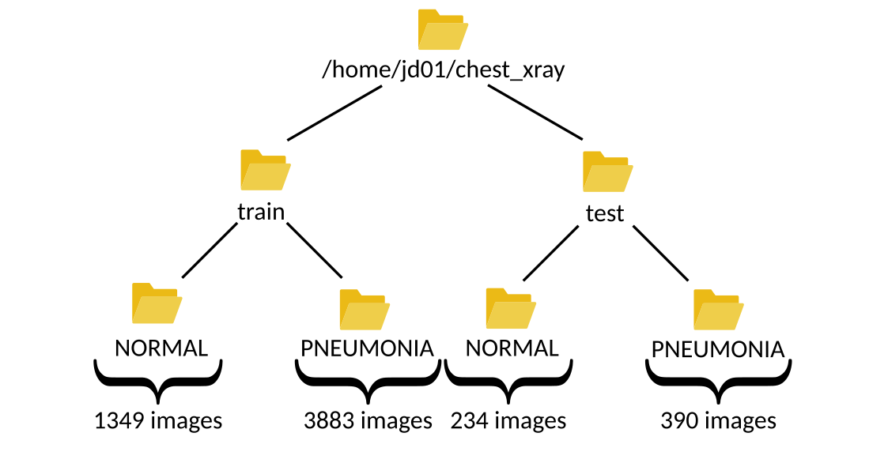
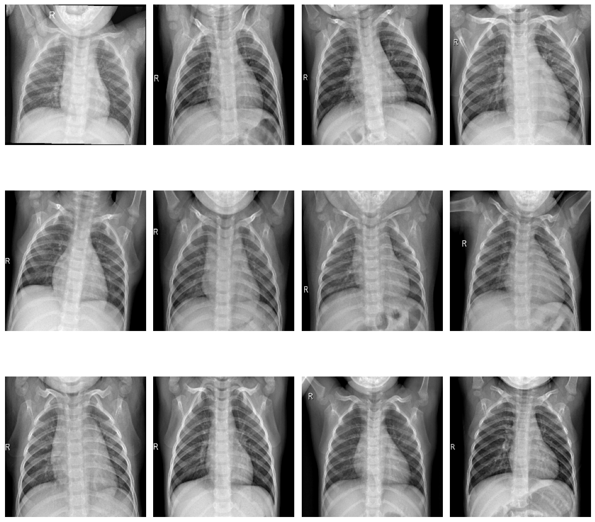
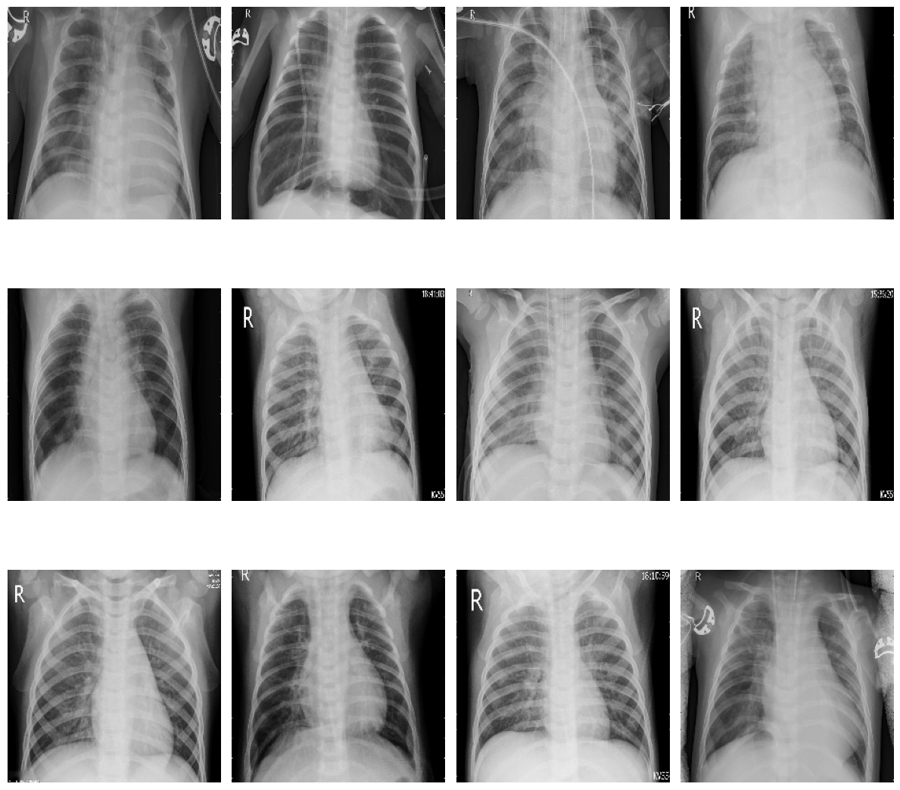

Pneumonia detection based on Chest X-Ray
########################################

.. note::

  This use case is still a work in progress. We will be
  adding more information in the coming days and this message will be
  removed once it's completely documented. Thank you for your patience.

This use-case is adapted from the Kaggle notebook
`Chest X-Ray (Pneumonia) - CNN & Transfer Learning <https://www.kaggle.com/code/jonaspalucibarbosa/chest-x-ray-pneumonia-cnn-transfer-learning/notebook>`_.

The purpose of the notebook is to apply Convolutional Neural Networks (CNNs) to Chest X-Ray images in order to identify cases of Pneumonia.
The dataset used is version 3 of the `Chest X-ray Images <https://www.kaggle.com/datasets/tolgadincer/labeled-chest-xray-images>`_, which includes separate folders for training and testing.
Within the notebook, the training set is further split into training and validation subsets.

Three approaches are explored for image classification:

1. Basic CNN architecture - A simple model built from scratch.
2. Transfer Learning - Using a pretrained model with frozen layers to extract features.
3. Fine-Tuning - Unfreezing the final layers of the pretrained model to improve performance.

To run the notebook's code in LARCC, you can:

1. Download the notebook from Kaggle, launch an instance of jupyter as described :ref:`here <jupyter>` and load the notebook in Jupyter.
2. Convert the notebook into a python script and run it through a batch or interactive job.

Option 2 offers added benefits like the abilty to speed-up the training of your models, consuming less memory and even creating pipelines
where multiple models can be trained at the same time.

There is, however, a slight problem no matter which option is chosen. The code uses an older version of tensorflow and thus must
be adapted to ensure it runs properly at the training phase.

1. Ingesting the data
=====================

Let's begin by familiarizing ourselves with the dataset. After downloading and extracting the files from Kaggle, you'll find two main folders:

- One containing images for training and validation.
- Another containing images for testing.

Assuming the user ``jd01`` stores the dataset in ``/home/jd01/chest_xray``, the directory structure will resemble the following:

The ``train`` folder contains a total of 5,232 images—1,349 from healthy patients and 3,883 from patients diagnosed with pneumonia.  
The ``test`` folder includes 624 images—234 healthy and 390 sick. These numbers can be verified using a simple script:

.. code-block:: python

  import os
  import glob

  main_path = "/home/jd01/chest_xray"
  train_path = os.path.join(main_path,"train")
  test_path=os.path.join(main_path,"test")

  train_normal = glob.glob(train_path+"/NORMAL/*.jpeg")
  train_pneumonia = glob.glob(train_path+"/PNEUMONIA/*.jpeg")

  test_normal = glob.glob(test_path+"/NORMAL/*.jpeg")
  test_pneumonia = glob.glob(test_path+"/PNEUMONIA/*.jpeg")

  num_img_train = len(train_normal) + len(train_pneumonia)
  num_img_test = len(train_normal) + len(train_pneumonia)

  print(f"Number of healthy patients in {train_path}: {len(train_normal)}" )
  print(f"Number of sick patients in {train_path}: {len(train_pneumonia)}" )
  print(f"Total number of images in {train_path}: {num_img_train}")

  print(f"Number of healthy patients in {test_path}: {len(test_normal)}" )
  print(f"Number of sick patients in {test_path}: {len(test_pneumonia)}" )
  print(f"Total number of images in {test_path}: {num_img_test}")

To visualize some these samples in a grid, we can define this function:

.. code-block:: python

    def plot_samples(samples, num_samples, rows, cols, save_as=''):
        assert rows*cols <= num_samples
        plt.figure(figsize=(num_samples,num_samples))

        for i in range(0, num_samples):
            plt.subplot(rows,cols,i + 1)
            img = cv2.imread(samples[i])
            img = cv2.resize(img, (IMG_SIZE,IMG_SIZE))
            plt.imshow(img)
            plt.axis("off")

        plt.tight_layout()
        if save_as != '':
            plt.savefig(save_as, bbox_inches='tight')
        else:
            plt.show()

and use it as follows:

.. code-block:: python

    plot_samples(train_normal, 12, 3, 4, save_as="train_samples_normal.png")

    Samples of healthy patients in training data

.. code-block:: python

    plot_samples(test_pneumonia, 12, 3, 4, save_as="train_samples_pneumonia.png")

    Samples of sick patients in training data

To facilitate further exploration, we can convert the image paths into dataframes:

.. code-block:: python

  import pandas as pd
  import numpy as np

  train_list = [x for x in train_normal]
  train_list.extend([x for x in train_pneumonia])

  df_train = pd.DataFrame(np.concatenate([['Normal']*len(train_normal) , ['Pneumonia']*len(train_pneumonia)]), columns = ['class'])
  df_train['image'] = [x for x in train_list]

  test_list = [x for x in test_normal]
  test_list.extend([x for x in test_pneumonia])

  df_test = pd.DataFrame(np.concatenate([['Normal']*len(test_normal) , ['Pneumonia']*len(test_pneumonia)]), columns = ['class'])
  df_test['image'] = [x for x in test_list]

This allows us to visualize the distribution of samples:

.. list-table:: 

    * - .. figure:: images/chest-xray/train_data_dist_barplot.png
           :scale: 70%

           Training data sample distribution

      - .. figure:: images/chest-xray/test_data_dist_barplot.png
           :scale: 70%

           Test data sample distribution
    * - .. figure:: images/chest-xray/train_data_dist_pieplot.png
           :scale: 70%

           Training data percentual distribution

      - .. figure:: images/chest-xray/test_data_dist_pieplot.png
           :scale: 70%

           Test data percentual distribution

Before building the model, we need to load the images from both the ``train`` and ``test`` folders.
The training data is split into two subsets:

- **Training set**: 80% of the images (~4,186 samples)
- **Validation set**: 20% of the images (~1,046 samples)

This split can be implemented as follows:

.. code-block:: python

  import tensorflow as tf

  IMG_SIZE = 224
  BATCH = 32
  SEED = 42
  VALIDATION_SPLIT = 0.20
  TRAINING_SPLIT = 1 - VALIDATION_SPLIT

  classes = [ 'NORMAL', 'PNEUMONIA' ]

  ds_train, ds_val = tf.keras.utils.image_dataset_from_directory(
    train_path,
    class_names = classes,
    labels = 'inferred',
    label_mode = 'binary',
    image_size = (IMG_SIZE, IMG_SIZE),
    batch_size = BATCH,
    seed = SEED,
    validation_split = VALIDATION_SPLIT,
    subset='both'
  )

  ds_test = tf.keras.utils.image_dataset_from_directory(
    test_path,
    class_names = classes,
    labels = 'inferred',
    label_mode = 'binary',
    image_size = (IMG_SIZE, IMG_SIZE),
    batch_size = 1,
    seed = SEED,
    shuffle = False
  )

Let's take a closer look at how ``tf.keras.utils.image_dataset_from_directory`` works when loading the training dataset:

- ``labels='inferred'``: Automatically assigns labels based on subfolder names. 
  For example, images in ``/work/jd01/chest_xray/train/PNEUMONIA`` and ``/work/jd01/chest_xray/train/NORMAL``
  will be labeled accordingly.
- ``batch_size=BATCH`` (e.g., ``BATCH=32``): Divides the dataset into batches of up to 32 samples.  
  - For ``ds_val`` (1,046 images): 33 batches (32 full, 1 with 22 images)
  - For ``ds_train`` (4,186 images): 131 batches (130 full, 1 with 26 images)
- ``subset='both'``: Returns both training and validation datasets.
- ``seed=SEED``: Ensures reproducibility across runs.
  Alternatively, you can generate ``ds_val`` and ``ds_train`` separately using
  ``subset='validation'`` and ``subset='training'``:

  .. code-block:: python

    ds_train = tf.keras.utils.image_dataset_from_directory(
      train_path,
      class_names = classes,
      labels = 'inferred',
      label_mode = 'binary',
      image_size = (IMG_SIZE, IMG_SIZE),
      batch_size = BATCH,
      seed = SEED,
      validation_split = VALIDATION_SPLIT,
      subset='training'
    )
    ds_val = tf.keras.utils.image_dataset_from_directory(
      train_path,
      class_names = classes,
      labels = 'inferred',
      label_mode = 'binary',
      image_size = (IMG_SIZE, IMG_SIZE),
      batch_size = BATCH,
      seed = SEED,
      validation_split = VALIDATION_SPLIT,
      subset='validation'
    )

Next, we preprocess the images to prepare them for training.
While the original code uses ``tf.keras.preprocessing.image.ImageDataGenerator``,
we'll opt for a more modern approach using ``tensorflow.keras.layers``:

.. code-block:: python

  from tensorflow import keras
  from tensorflow.keras import layers

  AUTOTUNE = tf.data.experimental.AUTOTUNE
  
  normalization_layer = layers.Rescaling(1./255)
  # To achieve a similar zoom range as ImageDataGenerator(zoom_range=0.1)
  # which is [0.9, 1.1] zoom factor.
  # The RandomZoom layer takes fractional factors, so -0.1 to 0.1 means
  # 1 - 0.1 to 1 + 0.1 zoom.
  zoom_layer = layers.RandomZoom(height_factor=(-0.1, 0.1), width_factor=(-0.1, 0.1))
  resize_layer = layers.RandomTranslation(height_factor=0.1, width_factor=0.1)

  ds_train = ds_train.map(lambda x, y: (normalization_layer(x), y), num_parallel_calls=AUTOTUNE)
  ds_train = ds_train.map(lambda x, y: (zoom_layer(x), y), num_parallel_calls=AUTOTUNE)
  ds_train = ds_train.map(lambda x, y: (resize_layer(x), y), num_parallel_calls=AUTOTUNE)

  ds_val = ds_val.map(lambda x, y: (normalization_layer(x), y), num_parallel_calls=AUTOTUNE)

  ds_test = ds_test.map(lambda x, y: (normalization_layer(x), y), num_parallel_calls=AUTOTUNE)

At this stage, we're ready to define and train our models.

2. Training the models
======================

To begin, we calculate the number of steps (batches) required for training and validation:

.. code-block:: python

  import math

  num_training_steps = math.ceil((num_img_train * TRAINING_SPLIT)/BATCH)
  num_validation_steps = math.ceil((num_img_train * VALIDATION_SPLIT)/BATCH)

As previously noted:

- ``num_training_steps = 131``
- ``num_validation_steps = 33``

After training, we will want to count the number of mispredictions from each model

.. code-block:: python

    def predict_and_count_misses(model, dataset, target_class):
        misses = 0
        for images, labels in dataset:
            predictions = model.predict(images, verbose=0)
            predicted_classes = (predictions > 0.5).astype("int32")

            for i in range(len(images)):
                if predicted_classes[i] != target_class:
                    continue
                if labels[i] != predicted_classes[i]:
                    misses += 1
        return misses

CNN Training and Validation
---------------------------

In this approach, we build a convolutional neural network (CNN) from scratch, without using any pre-trained models:

.. code-block:: python

  from tensorflow.keras import callbacks
  from tensorflow.keras.models import Model

  class ColorChannel:
    GREYSCALE = 1
    RGB = 3
    RGBA = 4

  def get_uncompiled_model(img_width, img_height, color_channel):
      inputs = layers.Input(shape=(img_width, img_height, color_channel))

      # Block One
      x = layers.Conv2D(filters=16, kernel_size=3, padding='valid')(inputs)
      x = layers.BatchNormalization()(x)
      x = layers.Activation('relu')(x)
      x = layers.MaxPool2D()(x)
      x = layers.Dropout(0.2)(x)

      # Block Two
      x = layers.Conv2D(filters=32, kernel_size=3, padding='valid')(x)
      x = layers.BatchNormalization()(x)
      x = layers.Activation('relu')(x)
      x = layers.MaxPool2D()(x)
      x = layers.Dropout(0.2)(x)

      # Block Three
      x = layers.Conv2D(filters=64, kernel_size=3, padding='valid')(x)
      x = layers.Conv2D(filters=64, kernel_size=3, padding='valid')(x)
      x = layers.BatchNormalization()(x)
      x = layers.Activation('relu')(x)
      x = layers.MaxPool2D()(x)
      x = layers.Dropout(0.4)(x)

      # Head
      #x = layers.BatchNormalization()(x)
      x = layers.Flatten()(x)
      x = layers.Dense(64, activation='relu')(x)
      x = layers.Dropout(0.5)(x)

      #Final Layer (Output)
      output = layers.Dense(1, activation='sigmoid')(x)

      model = keras.Model(inputs=[inputs], outputs=output)

      return model
  
  early_stopping = callbacks.EarlyStopping(
    monitor='val_loss',
    patience=5,
    min_delta=1e-7,
    restore_best_weights=True,
  )

  plateau = callbacks.ReduceLROnPlateau(
      monitor='val_loss',
      factor = 0.2,                                     
      patience = 2,                                   
      min_delt = 1e-7,                                
      cooldown = 0,                               
      verbose = 1
  )

  cnn_model = get_uncompiled_model(IMG_SIZE, IMG_SIZE, ColorChannel.RGB)
  cnn_model.compile(loss='binary_crossentropy'
                , optimizer = keras.optimizers.Adam(learning_rate=3e-5)
                , metrics=['binary_accuracy'])
  
  cnn_training_history = cnn_model.fit(
    ds_train,
    batch_size=BATCH, epochs=50,
    validation_data=ds_val,
    callbacks=[early_stopping, plateau],
    steps_per_epoch=num_training_steps,
    validation_steps=num_validation_steps
  )

  score = cnn_model.evaluate(ds_val, steps=num_validation_steps, verbose=0)
  print('(CNN) Val loss:', score[0])
  print('(CNN) Val accuracy:', score[1])

  misses = predict_and_count_misses(cnn_model, ds_val, 0)
  print(f'Validation - False Negatives: {misses}')
  misses = predict_and_count_misses(cnn_model, ds_val, 1)
  print(f'Validation - False Positives: {misses}')
  misses = predict_and_count_misses(cnn_model, ds_test, 0)
  print(f'Testing - False Negatives: {misses}')
  misses = predict_and_count_misses(cnn_model, ds_test, 1)
  print(f'Testing - False Positives: {misses}')

Transfer Learning Training and Validation
-----------------------------------------

Here, we leverage a pre-trained model as a feature extractor. Specifically, we use **ResNet152V2**
from the Keras Applications module  
(`link <https://keras.io/api/applications/resnet/#resnet152v2-function>`_).

This model was originally trained on the ImageNet dataset. By setting ``include_top=False``,
we remove the classification head and retain the feature extraction layers.
We then append custom layers tailored to our classification task:

.. code-block:: python

  def get_pretrained(base_model):
    #Input shape = [width, height, color channels]
    inputs = layers.Input(shape=(IMG_SIZE, IMG_SIZE, 3))
    
    x = base_model(inputs)

    # Head
    x = layers.GlobalAveragePooling2D()(x)
    x = layers.Dense(128, activation='relu')(x)
    x = layers.Dropout(0.1)(x)
    
    #Final Layer (Output)
    output = layers.Dense(1, activation='sigmoid')(x)
    
    model = keras.Model(inputs=[inputs], outputs=output)
    
    return model
  
  tl_base_model = tf.keras.applications.ResNet152V2(
    weights='imagenet',
    input_shape=(IMG_SIZE, IMG_SIZE, 3),
    include_top=False
  )
  tl_base_model.trainable = False

  keras.backend.clear_session()

  tl_model = get_pretrained(tl_base_model)
  tl_model.compile(
    loss='binary_crossentropy',
    optimizer = keras.optimizers.Adam(learning_rate=5e-5),
    metrics=['binary_accuracy']
  )
  tl_training_history = tl_model.fit(
    ds_train,
    batch_size=BATCH, epochs=50,
    validation_data=ds_val,
    callbacks=[early_stopping, plateau],
    steps_per_epoch=num_training_steps,
    validation_steps=num_validation_steps
  )

  score = tl_model.evaluate(ds_val, steps=num_validation_steps, verbose=0)
  print('(Transfer Learning) Val loss:', score[0])
  print('(Transfer Learning) Val accuracy:', score[1])

  misses = predict_and_count_misses(tl_model, ds_val, 0)
  print(f'Validation - False Negatives: {misses}')
  misses = predict_and_count_misses(tl_model, ds_val, 1)
  print(f'Validation - False Positives: {misses}')
  misses = predict_and_count_misses(tl_model, ds_test, 0)
  print(f'Testing - False Negatives: {misses}')
  misses = predict_and_count_misses(tl_model, ds_test, 1)
  print(f'Testing - False Positives: {misses}')

Fine Tuning Training and Validation
-----------------------------------

In the transfer learning setup, all layers of the pre-trained model are initially frozen to preserve their learned weights.  
Fine-tuning involves unfreezing a few of the final layers and continuing training,
allowing the model to adapt these layers to our dataset:

.. code-block:: python

  ft_base_model = tf.keras.applications.ResNet152V2(
    weights='imagenet',
    input_shape=(IMG_SIZE, IMG_SIZE, 3),
    include_top=False
  )
  ft_base_model.trainable = True

  # Freeze all layers except for the
  for layer in ft_base_model.layers[:-13]:
      layer.trainable = False

  # Check which layers are tuneable (trainable)
  for layer_number, layer in enumerate(ft_base_model.layers):
      print(layer_number, layer.name, layer.trainable)
  
  keras.backend.clear_session()
  
  ft_model = get_pretrained(ft_base_model)

  ft_model.compile(
    loss='binary_crossentropy',
    optimizer = keras.optimizers.Adam(learning_rate=2e-6), metrics=['binary_accuracy']
  )

  ft_training_history = ft_model.fit(
    ds_train,
    batch_size=BATCH, epochs=50,
    validation_data=ds_val,
    callbacks=[early_stopping, plateau],
    steps_per_epoch=num_training_steps,
    validation_steps=num_validation_steps
  )

  score = ft_model.evaluate(ds_val, steps=num_validation_steps, verbose = 0)
  print('(Fine Tuning) Val loss:', score[0])
  print('(Fine Tuning) Val accuracy:', score[1])

  misses = predict_and_count_misses(ft_model, ds_val, 0)
  print(f'Validation - False Negatives: {misses}')
  misses = predict_and_count_misses(ft_model, ds_val, 1)
  print(f'Validation - False Positives: {misses}')
  misses = predict_and_count_misses(ft_model, ds_test, 0)
  print(f'Testing - False Negatives: {misses}')
  misses = predict_and_count_misses(ft_model, ds_test, 1)
  print(f'Testing - False Positives: {misses}')

3. Visualize Metrics
====================

We look at 3 metrics here:

- **accuracy:** Calculates how often predictions equal labels. For the models in this use case,
  the objective is to obtain a good enough `Binary Accuracy <https://keras.io/api/metrics/accuracy_metrics/>`_.
- **loss:** quantifies the difference between the model's predicted output and the actual ground truth values.
  For the models in this use case, the objective is to minimize the
  `Binary Crossentropy <https://keras.io/api/losses/probabilistic_losses/#binarycrossentropy-class>`_ loss function
  through iterative adjustments of the model's internal parameters
- **ROC Curve:** Computes the False Positive Rates (FPR), True Positive Rates (TPR),
  and corresponding thresholds for different classification thresholds.

We use the functions
below to generate plots for the accuracy and loss metrics given a model's training history,
and the ROC Curve given a model and a dataset to predict against:

.. code-block:: python

  def plot_accuracy(title, history, fig_size=(20,8), fontsize=16, save_as=''):
    fig, ax = plt.subplots(figsize=fig_size)
    plt.xticks(fontsize=fontsize)
    plt.yticks(fontsize=fontsize)
    sns.lineplot(x = history.epoch, y = history.history['binary_accuracy'], label='train')
    sns.lineplot(x = history.epoch, y = history.history['val_binary_accuracy'], label='val')
    ax.set_title(title, fontsize=fontsize)
    ax.set_ylabel('Accuracy', fontsize=fontsize)
    ax.set_xlabel('Epoch', fontsize=fontsize)
    ax.set_ylim(0.7, 1.0)
    ax.legend(frameon=True, fancybox=True, shadow=False, fontsize=fontsize)
    if save_as != '':
        fig.savefig(save_as)
    else:
        fig.show()

  def plot_loss(title, history, fig_size=(20,8), fontsize=16, save_as=''):
    fig, ax = plt.subplots(figsize=fig_size)
    plt.xticks(fontsize=fontsize)
    plt.yticks(fontsize=fontsize)
    sns.lineplot(x = history.epoch, y = history.history['loss'], label='train')
    sns.lineplot(x = history.epoch, y = history.history['val_loss'], label='val')
    ax.set_title(title, fontsize=fontsize)
    ax.set_ylabel('Loss', fontsize=fontsize)
    ax.set_xlabel('Epoch', fontsize=fontsize)
    ax.set_ylim(0, 0.5)
    ax.legend(frameon=True, fancybox=True, shadow=False, fontsize=fontsize)
    if save_as != '':
        fig.savefig(save_as)
    else:
        fig.show()

  def plot_roc_curve(model, dataset, title='Receiver Operating Characteristic (ROC) Curve', save_as=''):
    y_true = []
    y_scores = []
    
    for images, labels in dataset:
        probs = model.predict(images, verbose=0).flatten()
        y_scores.extend(probs)
        y_true.extend(labels.numpy().flatten())
    
    y_true = np.array(y_true)
    y_scores = np.array(y_scores)
    
    # Compute ROC curve and AUC
    fpr, tpr, thresholds = roc_curve(y_true, y_scores)
    roc_auc = auc(fpr, tpr)
    
    # Plot ROC curve
    plt.figure(figsize=(8, 6))
    plt.plot(fpr, tpr, color='blue', lw=2, label=f'ROC curve (AUC = {roc_auc:.2f})')
    plt.plot([0, 1], [0, 1], color='gray', lw=1, linestyle='--')
    plt.xlabel('False Positive Rate')
    plt.ylabel('True Positive Rate')
    plt.title(title)
    plt.legend(loc='lower right')
    plt.grid(True)
    plt.tight_layout()
    if save_as != '':
        plt.savefig(save_as)
    else:
        plt.show()

The functions are used as follows:

.. code-block:: python

  plot_accuracy(
    'CNN Learning Curve (Accuracy)',
    cnn_training_history,
    save_as='cnn_learning_curve_accuracy.png'
  )
  plot_accuracy(
    'Transfer Learning Learning Curve (Accuracy)',
    tl_training_history,
    save_as='tl_learning_curve_accuracy.png'
  )
  plot_accuracy(
    'Fine Tuning Learning Curve (Accuracy)',
    ft_training_history,
    save_as='ft_learning_curve_accuracy.png'
  )

.. list-table::

    * - .. image:: images/chest-xray/cnn_learning_curve_accuracy.png

    * - .. image:: images/chest-xray/tl_learning_curve_accuracy.png

    * - .. image:: images/chest-xray/ft_learning_curve_accuracy.png

.. code-block:: python

  plot_loss(
    'CNN Learning Curve (Loss)',
    cnn_training_history,
    save_as='cnn_learning_curve_loss.png'
  )
  plot_loss(
    'Transfer Learning Learning Curve (Loss)',
    tl_training_history,
    save_as='tl_learning_curve_loss.png'
  )
  plot_loss(
    'Fine Tuning Learning Curve (Loss)',
    ft_training_history,
    save_as='ft_learning_curve_loss.png'
  )

.. list-table::

    * - .. image:: images/chest-xray/cnn_learning_curve_loss.png

    * - .. image:: images/chest-xray/tl_learning_curve_loss.png

    * - .. image:: images/chest-xray/ft_learning_curve_loss.png

.. code-block:: python
  
  plot_roc_curve(
    cnn_model, ds_test,
    title='CNN ROC Curve (Testing set)',
    save_as='cnn_roc_curve_testing.png'
  )
  plot_roc_curve(
    cnn_model, ds_val,
    title='CNN ROC Curve (Validation set)',
    save_as='cnn_roc_curve_validation.png'
  )

  plot_roc_curve(
    tl_model, ds_val,
    title='Transfer Learning ROC Curve (Validation set)',
    save_as='tl_roc_curve_validation.png'
  )
  plot_roc_curve(
    tl_model, ds_test,
    title='Transfer Learning ROC Curve (Testing set)',
    save_as='tl_roc_curve_testing.png'
  )

  plot_roc_curve(
    model_pretrained, ds_val,
    title='Fine Tuning ROC Curve (Validation set)',
    save_as='ft_roc_curve_validation.png'
  )
  plot_roc_curve(
    model_pretrained, ds_test,
    title='Fine Tuning ROC Curve (Testing set)',
    save_as='ft_roc_curve_testing.png'
  )

.. list-table::

    * - .. image:: images/chest-xray/cnn_roc_curve_validation.png

      - .. image:: images/chest-xray/cnn_roc_curve_testing.png

    * - .. image:: images/chest-xray/tl_roc_curve_validation.png

      - .. image:: images/chest-xray/tl_roc_curve_testing.png

    * - .. image:: images/chest-xray/ft_roc_curve_validation.png

      - .. image:: images/chest-xray/ft_roc_curve_testing.png

4. Save your results for further analyses
=========================================

We use the functions below to save training and prediction metrics
in CSV format in case such information needs to be processed later and/or on another software.
For example, is you want to analyze it more interactively using Microsoft Excel.

.. code-block:: python

    def get_yscores(model, dataset):
        y_true = []
        y_scores = []

        for images, labels in dataset:
            probs = model.predict(images, verbose=0).flatten()
            y_scores.extend(probs)
            y_true.extend(labels.numpy().flatten())

        y_true = np.array(y_true)
        y_scores = np.array(y_scores)
        return (y_true, y_scores)

    def save_training_metrics_per_epoch(model_name, history):
        df = pd.DataFrame(
            data={'epoch': history.epoch, 'train_accuracy': history.history['binary_accuracy'], 
                    'val_accuracy': history.history['val_binary_accuracy']}
        )
        df.to_csv(f'{model_name}_accuracy_per_epoch.csv', index=False)
        df = pd.DataFrame(
            data={'epoch': history.epoch, 'train_loss': history.history['loss'], 
                  'val_loss': history.history['val_loss']}
        )
        df.to_csv(f'{model_name}_loss_per_epoch.csv', index=False)
    
    def save_prediction_metrics(model_name, ds_name, model, dataset):
        prefix = f'{model_name}_{ds_name}'
        y_true, y_scores = get_yscores(model, dataset)
        df = pd.DataFrame(
            data={'y_true':y_true, 'y_scores': y_scores}
        )
        df.to_csv(f'{prefix}_yscores.csv', index=False)

        fpr, tpr, thresholds = roc_curve(y_true, y_scores)
        df = pd.DataFrame(
            data={'fpr': fpr, 'tpr':tpr, 'thresholds':thresholds}
        )
        df.to_csv(f'{prefix}_roc.csv', index=False)

The functions are used as follows:

.. code-block:: python

    model_names = [ "cnn", "tl", "ft" ]
    models = [ cnn_model, tl_model, ft_model ]
    training_histories = [ 
        cnn_training_history,
        tl_training_history,
        ft_training_history
    ]
    for name, model, history in zip(model_names, models, training_histories):
        save_training_metrics_per_epoch(name, history)
        save_prediction_metrics(name, 'validation', model, ds_val)
        save_prediction_metrics(name, 'test', model, ds_test)